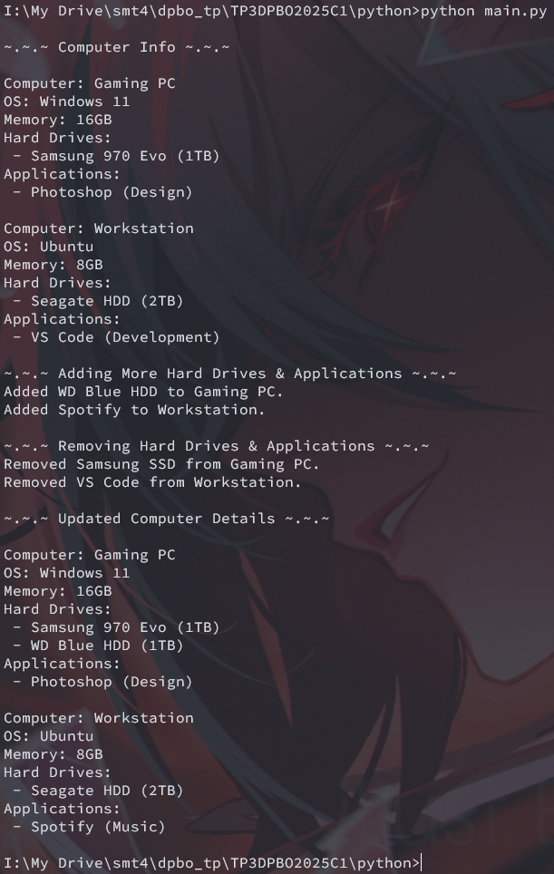

# Janji 
Saya Yusrilia Hidayanti dengan NIM 2306828 mengerjakan Tugas Praktikum 3 dalam mata kuliah Desain dan Pemrograman Berorientasi Objek untuk keberkahanNya maka saya tidak melakukan kecurangan seperti yang telah dispesifikasikan. Aamiin.

# Diagram
Berikut adalah diagram kelas:

# Desain Program
Desain menerapkan konsep Object-Oriented Programming (OOP) dengan fitur berikut:

- __*[wajib]*__ Inheritance: Application dan OperatingSystem mewarisi Software, Harddrive mewarisi Storage dan Hardware, dan Memory mewarisi Hardware.
- __*[wajib]*__ Composition: Kelas Computer menggunakan composition dengan Memory, HardDrive, OperatingSystem dan Application.
- __*[wajib]*__ Array of Object: Computer menyimpan banyak HardDrive dan Application dalam bentuk array.
- __*[bonus]*__ Hierarchical Inheritance: Application dan OperatingSystem mewarisi Software.
- __*[bonus]*__ Multiple Inheritance: HardDrive mewarisi Storage dan Hardware.
- __*[bonus]*__ Hybrid Inheritance: Kombinasi hierarchical dan multiple inheritance.

## Detail Kelas
### Storage
Kelas dasar untuk penyimpanan yang memiliki atribut:
- capacity: Kapasitas penyimpanan.
- type: Jenis penyimpanan (SSD, HDD, dll).

### Hardware
Kelas dasar untuk hardware yang memiliki atribut:
- name: Nama perangkat.
- price: Harga perangkat.
- warrantyPeriod: Masa garansi.
- brand: Merek perangkat.

### HardDrive (Turunan dari Storage dan Hardware)

Merepresentasikan hard drive dengan atribut tambahan:
- cache: Ukuran cache penyimpanan.
### Memory (Turunan dari Hardware)

Merepresentasikan RAM dengan atribut tambahan:
- size: Ukuran RAM (dalam GB).
- speed: Kecepatan RAM (dalam MHz).

### Software

Kelas dasar untuk software yang memiliki atribut:
- name: Nama software.
- version: Versi software.
### Application (Turunan dari Software)

Merepresentasikan aplikasi dengan atribut tambahan:
- category: Kategori aplikasi.
- license: Jenis lisensi aplikasi.

### OperatingSystem (Turunan dari Software)
Merepresentasikan sistem operasi dengan atribut tambahan:
- architecture: Arsitektur sistem operasi (32-bit/64-bit).
- kernelType: Jenis kernel sistem operasi.

### Computer

Merepresentasikan sebuah komputer yang memiliki atribut:
- type: Jenis komputer (Gaming PC, Workstation, dll).
- operatingSystem: Sistem operasi yang digunakan.
- memory: Memori/RAM yang digunakan.
- hardDrives: Daftar hard drive yang terpasang.
- applications: Daftar aplikasi yang terinstal.

Fungsi dalam Computer:
- addHardDrive(hardDrive): Menambahkan hard drive ke komputer.
- removeHardDrive(name): Menghapus hard drive berdasarkan nama.
- addApplication(application): Menambahkan aplikasi ke komputer.
- removeApplication(name): Menghapus aplikasi berdasarkan nama.
- printInfo(): Menampilkan informasi lengkap komputer.

# Penjelasan alur
1. Program membuat dua komputer

2. Program menambahkan hard drive dan aplikasi ke komputer menggunakan fungsi addHardDrive dan addApplication.

3. Program menghapus beberapa perangkat dan aplikasi.

4. Program menampilkan informasi komputer sebelum dan sesudah diupdate.

# Dokumentasi
