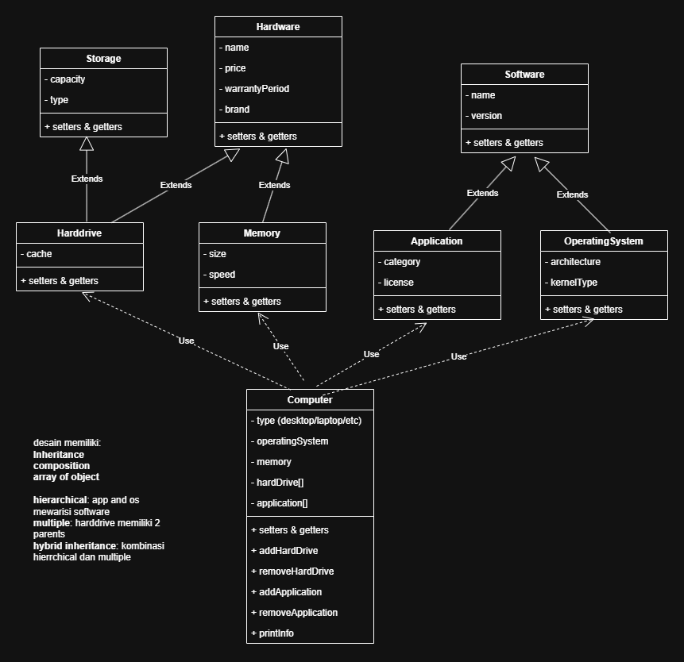
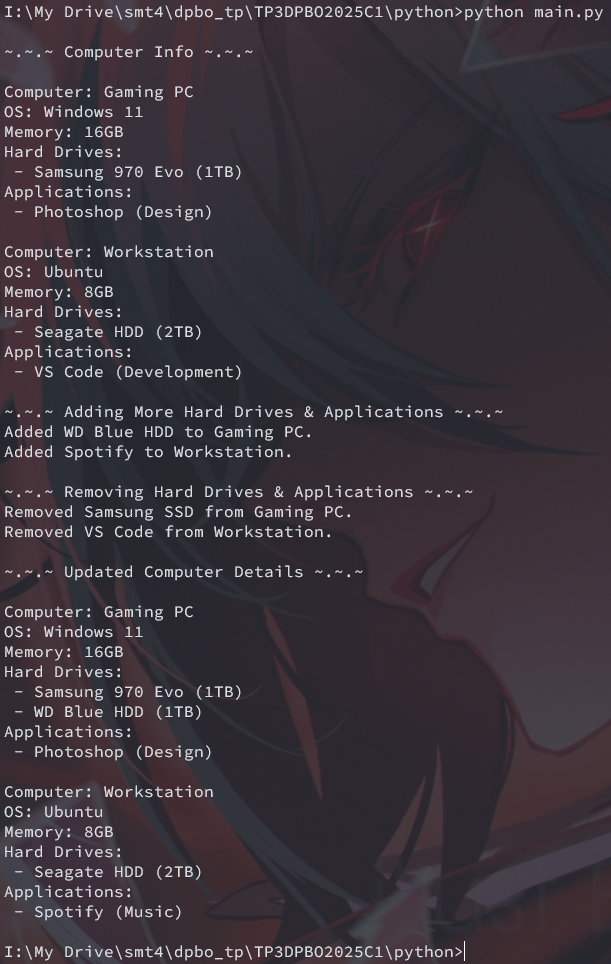

# Janji 
Saya Yusrilia Hidayanti dengan NIM 2306828 mengerjakan Tugas Praktikum 3 dalam mata kuliah Desain dan Pemrograman Berorientasi Objek untuk keberkahanNya maka saya tidak melakukan kecurangan seperti yang telah dispesifikasikan. Aamiin.

# Diagram
Berikut adalah diagram kelas:

# Desain Program
Desain menerapkan konsep Object-Oriented Programming (OOP) dengan fitur berikut:

- __*[wajib]*__ __Inheritance__: `Application` dan `OperatingSystem` mewarisi `Software`, `Harddrive` mewarisi `Storage` & `Hardware`, dan `Memory` mewarisi `Hardware`.
- __*[wajib]*__ __Composition__: Kelas `Computer` menggunakan composition dengan `Memory`, `HardDrive`, `OperatingSystem` dan `Application`.
- __*[wajib]*__ __Array of Object__: `Computer` menyimpan banyak `HardDrive` dan `Application`` dalam bentuk array.
- __*[bonus]*__ __Hierarchical Inheritance__: `Application` dan `OperatingSystem` mewarisi `Software`.
- __*[bonus]*__ __Multiple Inheritance__: `HardDrive` mewarisi `Storage` dan `Hardware`.
- __*[bonus]*__ __Hybrid Inheritance__: Kombinasi hierarchical dan multiple inheritance.

## Detail Kelas
### Storage
- `capacity`: Kapasitas penyimpanan.
- `type`: Jenis penyimpanan.

### Hardware
- `name`: Nama perangkat.
- `price`: Harga perangkat.
- `warrantyPeriod`: Masa garansi.
- `brand`: Merek perangkat.

### HardDrive (Turunan dari Storage dan Hardware)
- `cache`: Ukuran cache penyimpanan.

### Memory (Turunan dari Hardware)
- `size`: Ukuran RAM (dalam GB).
- `speed`: Kecepatan RAM (dalam MHz).

### Software
- `name`: Nama software.
- `version`: Versi software.

### Application (Turunan dari Software)
- `category`: Kategori aplikasi.
- `license`: Jenis lisensi aplikasi.

### OperatingSystem (Turunan dari Software)
- `architecture`: Arsitektur sistem operasi (32-bit/64-bit).
- `kernelType`: Jenis kernel sistem operasi.

### Computer
- `type`: Jenis komputer (Gaming PC, Workstation, dll).
- `operatingSystem`: Sistem operasi yang digunakan.
- `memory`: Memori/RAM yang digunakan.
- `hardDrives`: Daftar hard drive yang terpasang.
- `applications`: Daftar aplikasi yang terinstal.

Methods dalam Computer:
- `addHardDrive(hardDrive)`: Menambahkan hard drive ke komputer.
- `removeHardDrive(name)`: Menghapus hard drive berdasarkan nama.
- `addApplication(application)`: Menambahkan aplikasi ke komputer.
- `removeApplication(name)`: Menghapus aplikasi berdasarkan nama.
- `printInfo()`: Menampilkan informasi lengkap komputer.

# Penjelasan Alur Program
1. Program membuat dua komputer di dalam array of objects.
2. Program menambahkan hard drive dan aplikasi ke komputer menggunakan fungsi `addHardDrive()` dan `addApplication()`.

3. Program menghapus beberapa perangkat dan aplikasi menggunakan fungsi `removeHardDrive()` dan `removeApplication()`.

4. Program menampilkan informasi komputer sebelum dan sesudah diupdate.

# Dokumentasi
